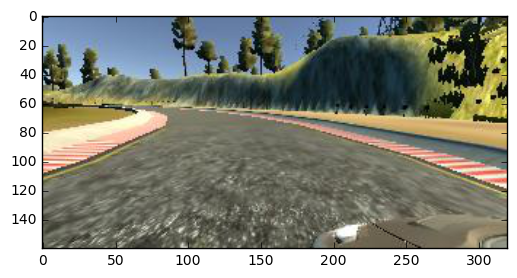

# Use Deep Learning to Clone Driving Behavior

## Convolutional Neural Network Architecture

CNN based on the NVidia example, which has been able to successfully steer a real-world self-driving car cwithout human intervention more than 90% of the time in recent tests under all sorts of road conditions. The model consists of an initial layer which subsamples the 320x160 image to produce a 64x32 image, in order to decrease the input size without losing features of the image (road boundaries, horizon, etc.). Then, several 2D convolutional layers with 2x2 max pooling and increasing filter depth are used, to reduce the image dimensions while simultaneously provide a larger semantic depth. The goal for these initial layers is to recognize small patterns- line segments are various locations, and with various slopes, etc.  There are two additional convolutional layers without striding to allow for recognition of more complex features in the images. 

Then there is a flattening layer, which allows the 3D output of a conv filter to be turned into a 1D vector to be fed into a traditional neural network to identify the desired steering angle for the image. These hidden layers have widths of 1164, 100, 50, 10 and finally the output layer, which consists of one neuron.

All of the activations in the model use the relu unit, which avoids the problem of gradient vanishing associated with the sigmoid function. Dropout is used for the flat layers as a form of regularization to improve the robustness of the model. Finally, batch normalization is used after every layer to reduce the internal covariate shifts of the weights in each layer. All weights and biases are initialized by drawing from a normal distribution with zero mean.

The complete architecture of the model is summarized in this table:


|Layer                     |Output Dimensions    | 
|--------------------------|---------------------|
|Input                     | ?x160x320x3         |
|Downsample                | ?x32x64x3           |
|1st Convolutional Layer   | ?x28x60x24          |
|    Relu Layer            | ?x28x60x24          |
|    Max Pooling Layer     | ?x14x30x24          |
|2nd Convolutional Layer   | ?x10x26x36          | 
|    Relu Layer            | ?x10x26x36          |
|    Max Pooling Layer     | ?x5x13x36           |
|3rd Convolutional Layer   | ?x3x11x64           |
|    Relu Layer            | ?x3x11x64           |
|    Max Pooling Layer     | ?x1x9x64            |
|Flatten                   | ?x576               |
|1st Fully Connected Layer | ?x1164              |
|    Relu Layer            | ?x1164              |
|2nd Fully Connected Layer | ?x100               |
|    Relu Layer            | ?x100               |
|3rd Fully Connected Layer | ?x50                |
|    Relu Layer            | ?x50                |
|4th Fully Connected Layer | ?x10                |
|    Relu Layer            | ?x10                |
|Output Layer              | ?x1                 | 

## Obtaining Training Examples

The training data for the model was obtained by using a driving simulator provided by Udacity. The simulator records the steering angle controlled by the human user as a car on the screen maneuvers around a track. Care needs to be taken to ensure that valid data is obtained- there can be no crashes, etc. After experimentation, I determined that the best dataset would include careful centerline driving- one lap clockwise, and one lap counterclockwise, and one lap each of shoulder recovery driving from the right to the center, and from the left to the center. 

Initially considered obtaining additional data at various trouble spots (sharp left hand turns, where a confounding dirt road proceeds straight, and a sharp right turn in a track consisting almost exclusively of left hand turns), but in the end decided that these extra datapoints might possibly contaminate the weights of the model. Interestingly, I tried adding training data (images and steering angle) for one particularly hard section by repeating the same section 4 times, but the model would still fail there, with the car swerving off the road. I decided to instead focus on improving the robustness of the model itself. One of the main helpful things added here was the recent idea of batch normalization after each layer. This seemed to significantly increase the robustness of the driving model.

Experimented with various enhancements of the dataset. For example, I tried flipping the images left-right and using -1 * steering_angle for additional training examples. I also tried using the provided left and right camera images and adjusted the measured steering angle by adding or subtracting a fixed value to accomodate the larger steering correction needed if the center camera had the same view as one of these side cameras. However, in the end, I ended up not using these generated samples. They made the training process much slower (by a factor of 2 or 3), and seemed to not help when testing the performance of the model on the track.

The pixel values were normalized with a linear transform from integers in the range 0-255 to real numbers -1.0 to +1.0. The drive.py script was edited to perform this same normalization on the images used to calculate steering angle during simulation.


```python
import csv
use_left_right_cameras = True
image_files = []
num_images = 0
with open('driving_log.csv', 'r') as f:
    reader = csv.reader(f)
    for row in reader:
        
        center_image, left_image, right_image, center_angle = row[:4]

        image_files.append(center_image.strip())
        num_images += 1
            
        if use_left_right_cameras:
            image_files.append(right_image.strip())
            image_files.append(left_image.strip())
print("Images in training set: ",num_images)
print(image_files[0])
print(image_files[1])
print(image_files[2])
```

    Images in training set:  6903


### Images from center, right and left cameras


```python

import matplotlib.pyplot as plt
%matplotlib inline
for img_file in image_files[0:3]:
    img = plt.imread(img_file)
    plt.figure()
    plt.imshow(img)
```





## Training the Model

I use the Adam (Adaptive Moment Estimation) optimizer, based on good experience with it in previous deep learning projects. For this optimizer, no training rate needs to be specified, because the optimizer itself calculates it on the fly based on the optimization history. 

Since the output of our model is a single real-valued number (steering angle), we are performing regression rather than classification. Thus, we do not use an sigmoid or softmax operation on the final neuron to obtain a class probability. We therefore do not use cross entropy, as we would for a classifier, but instead use Mean Square Error (MSE), as we are trying to obtain a set of weights and biases for the many layers in our deep model that reduce all the pixel values in an entire 320x160 image to a single desired number, the steering angle.

To fit the model, we obtain a train-test split of our 6903 training samples, using 30% of the data for the validation
data for keras. 

Below is the Keras output of training our model. We see that the training MSE is steadily decreasing as is the validation MSE. There is no evidence of overfitting after 10 epochs (the validation MSE is still decreasing, and its value is less than the training MSE.) However, the car is able to stay on the track with only this amount of training!

### Keras outout for training our CNN 

Epoch 3/10  
4832/4832 [==============================] - 69s - loss: 0.0345 - mean_squared_error: 0.0345 - val_loss: 0.0592 - val_mean_squared_error: 0.0592  
Epoch 4/10  
4832/4832 [==============================] - 69s - loss: 0.0324 - mean_squared_error: 0.0324 - val_loss: 0.0381 - val_mean_squared_error: 0.0381  
Epoch 5/10  
4832/4832 [==============================] - 67s - loss: 0.0313 - mean_squared_error: 0.0313 - val_loss: 0.0387 - val_mean_squared_error: 0.0387  
Epoch 6/10  
4832/4832 [==============================] - 67s - loss: 0.0312 - mean_squared_error: 0.0312 - val_loss: 0.0305 - val_mean_squared_error: 0.0305  
Epoch 7/10  
4832/4832 [==============================] - 68s - loss: 0.0303 - mean_squared_error: 0.0303 - val_loss: 0.0257 - val_mean_squared_error: 0.0257  
Epoch 8/10  
4832/4832 [==============================] - 67s - loss: 0.0298 - mean_squared_error: 0.0298 - val_loss: 0.0252 - val_mean_squared_error: 0.0252  
Epoch 9/10  
4832/4832 [==============================] - 66s - loss: 0.0296 - mean_squared_error: 0.0296 - val_loss: 0.0255 - val_mean_squared_error: 0.0255  
Epoch 10/10  
4832/4832 [==============================] - 67s - loss: 0.0292 - mean_squared_error: 0.0292 - val_loss: 0.0253 - val_mean_squared_error: 0.0253  


```python

```
