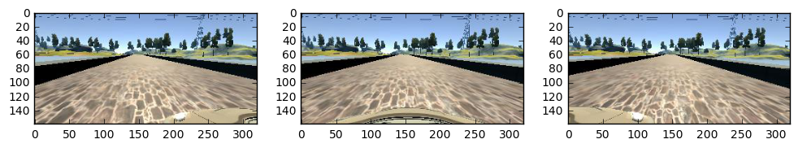

# Behavioral Cloning

## Model Training

### Original Images & Steering Angle Adjustment
Images from all 3 simulated cameras (left, center, right) were used. A steering angle adjustment of +/- 0.07 were added onto the steering angle when using the left/right images. The angle adjustment was derived empirically by trial and error of the model on the simulator. Higher and higher values resulted in zig-zag, oscillated driving.

Below are the number of images generated with slow, centerline driving on the 50 Hz simulator:


```python
from training_validation import parent_directories

for directory in parent_directories:
    !echo {directory} `ls -al {directory}/IMG | wc -l`
```

    data/track1/forward/center 107058
    data/track1/backward/center 128763


### Augmentation of Images
The steering angles in this project's generated dataset are also biased towards zero. But, the distribution of left/right steering is more balanced due to driving both clockwise and counter-clockwise on the track:


```python
%matplotlib inline

from training_validation import build_dataframes

training_samples, validation_samples = build_dataframes()

steering_angles = training_samples['steering_angle']
steering_angles.plot.hist(bins=100, title="Most Frequent Steering Angles")
```

    <matplotlib.axes._subplots.AxesSubplot at 0x7fd2a4124d30>

	


To generate an even greater variety of training data, random brightness changes and translations (both vertical and horizontal) were applied to images.However, the image augmentation functions were implemented with the Python Imaging Library (PIL) instead of OpenCV.

Additionally, the following were also implemented:
* Cropping out a reasonable amount of the sky and hood of the car in order to ensure the model can "focus" on the most relevant parts of the image and learn to steer based on lane lines.
* Random horizontal image flipping derived from Keras' ImageDataGenerator open source code

Finally, the image is resized to the expected model input size of 64x32.

#### Example Left, Center, Right Images


```python
import pandas as pd
from training_validation import column_names
from PIL import Image
import matplotlib.pyplot as plt

training_samples = pd.read_csv(parent_directories[0] + '/driving_log.csv', header=None, names=column_names, low_memory=False)
test_sample =  training_samples.sample(1).iloc[0]
center_img_filepath = test_sample['center_image'].strip()
left_img_filepath = test_sample['left_image'].strip()
right_img_filepath = test_sample['right_image'].strip()
steering_angle = test_sample['steering_angle']
print('steering angle', steering_angle)
filepaths = [left_img_filepath, center_img_filepath, right_img_filepath]
fig = plt.figure(figsize=(12, 6))
filepaths_count = len(filepaths)
rows = 1
for i in range(filepaths_count):
    sp = fig.add_subplot(rows, filepaths_count//rows, i+1)
    img = Image.open(filepaths[i])
    plt.imshow(img)
```

    steering angle -0.007274489




#### Example Augmentations


```python
from img_transformations import translate, brighten_or_darken, cropout_sky_hood

img = Image.open(center_img_filepath)
img = brighten_or_darken(img, brightness_factor_min=0.25)
img, steering_angle = translate(img, steering_angle)
img = cropout_sky_hood(img)
print('translated steering angle', steering_angle)
img = img.resize((64, 32))
plt.imshow(img)
```

    translated steering angle 0.0261531866729

    <matplotlib.image.AxesImage at 0x7fd298be87b8>


