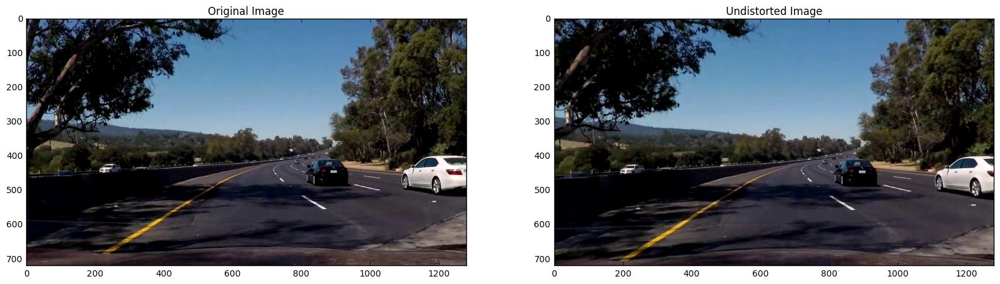
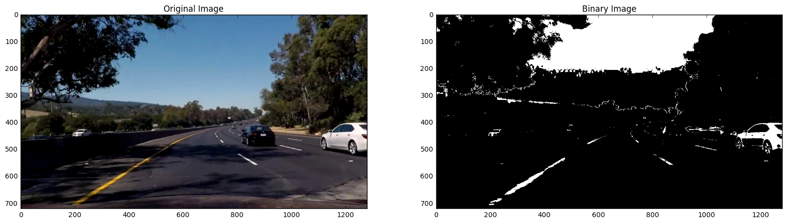
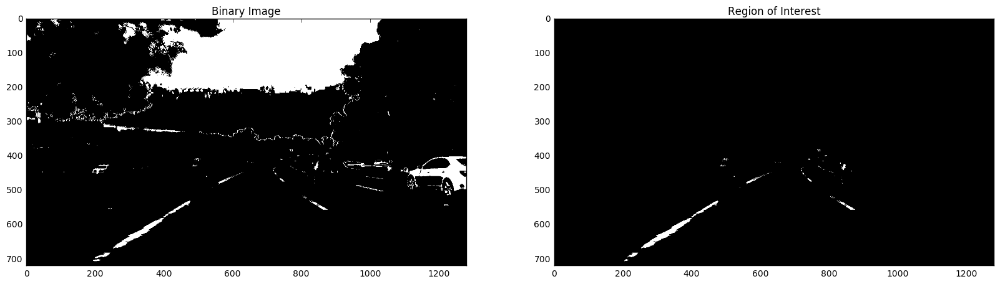
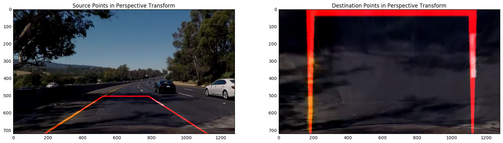
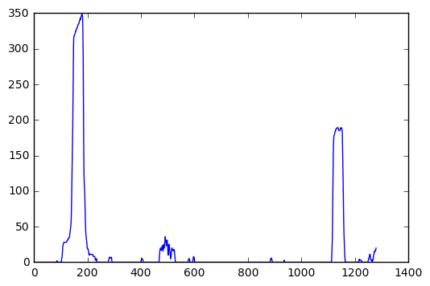
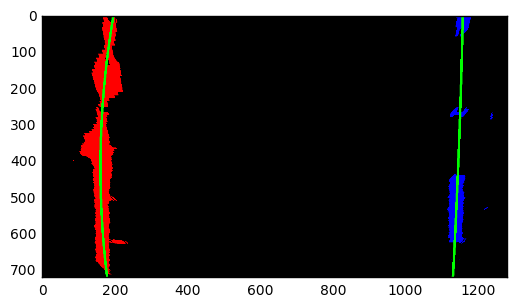
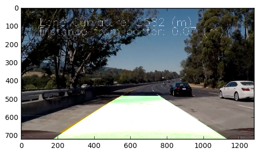

## Advanced Lane Finding
[](http://www.udacity.com/drive)

The goals / steps of this project are the following:  

* Compute the camera calibration matrix and distortion coefficients given a set of chessboard images.
* Apply the distortion correction to the raw image.  
* Use color transforms, gradients, etc., to create a thresholded binary image.
* Apply a perspective transform to rectify binary image ("birds-eye view"). 
* Detect lane pixels and fit to find lane boundary.
* Determine curvature of the lane and vehicle position with respect to center.
* Warp the detected lane boundaries back onto the original image.
* Output visual display of the lane boundaries and numerical estimation of lane curvature and vehicle position.


## Student Instructions

The images for camera calibration are stored in the folder called `camera_cal`.  The images in `test_images` are for testing your pipeline on single frames.  To help the reviewer examine your work, please save examples of the output from each stage of your pipeline in the folder called `ouput_images`, and include a description in the README for the project of what each image shows.    The video called `project_video.mp4` is the video your pipeline should work well on.  

The `challenge_video.mp4` video is an extra (and optional) challenge for you if you want to test your pipeline under somewhat trickier conditions.  The `harder_challenge.mp4` video is another optional challenge and is brutal!

If you're feeling ambitious (again, totally optional though), don't stop there!  We encourage you to go out and take video of your own, calibrate your camera and show us how you would implement this project from scratch!


## Rubric Points
Here I will consider the rubric points individually and describe how I addressed each point in my implementation.

### 1. Camera Calibration

##### Code Location

Function `calibrate_camera` in cells `In [2]` and `In [3]` of the Jupyter notebook

##### Process

1. Count the number of inner `corners` per row and column
2. Prepare a list of `object points` from these corners, which will be the same for all images in the set of calibration images
3. For each image in the set of calibration images:
    1. Find the image chess corners using opencv function `findChessboardCorners`
    2. Append object points(same for all images) and image points to different lists
4. 	The camera is calibrated using opencv function `calibrateCamera` using the object points and image points obtained above to obtain the distortion coefficients and camera coefficient matrix.

##### Example on calibration image


## Pipeline (Single Images)

##### 1. Distortion Correction

The camera matrix and distortion coefficients obtained in the previous steps were used to correct distortion in each frame of the video. An example is given below:



##### 2. Creation of Thresholded Binary Image

There are several functions in my code that do different kinds of thresholding:

1. `get_grayscale_thresholded_img` in cell `In [10]` converts to grayscale using the cv2 `cvtColor` function and performs thresholding using the `thresh` parameter.

2. `get_sobel_binary` in cell `In [12]` converts the image to grayscale, applies a sobel operator in the X direction, takes the absolute value, scales the result in the range 0-255 and performs a thresholding operation.

3. `get_hls_channel_binary` in cell `In [15]` performs thresholding on either the H, L or S channel of the image depending on the input parameter.

4. `get_color_selection` in cell `In [17]` performs color selection on the image converted to HLS color space by only selecting Yellow and White colors and returns the binary mask for the same.

5. `get_binary_image` in cell `In [19]` combines the above operations to produce a binary image of the input image.

An example of the result of calling `get_binary_image` on an image is shown below:



##### 3. Region of Interest Selection

1. `select_region_of_interest` in cell `In [21]` performs a region of selection by  choosing the four points bounding a region using the image dimensions:



##### 4. Perspective Transform

1. One of the test images were picked
2. Hough lines were drawn on the test image
3. The end points of the hough lines were used as the `src` points in the perspective transform
4. A rectangle derived from the src points was used as the `dst` points in the hough transform.
5. The transformation matrix was calculated using the opencv function `getPerspectiveTransform`
6. The relevant code can be seen in the cells `In [32]`, `In [33]` and `In [34]`. A snippet is shown below:

```
   # Determine the original and destination points based on the hough lines
    line1, line2 = lines
    
    # Top Right, # Bottom Right, # Top left, # Bottom left
    original_img_pts = [[line1[0], line1[1]], [line1[2], line1[3]], [line2[0], line2[1]], [line2[2], line2[3]]]
    
    destination_pts = [[line1[2], y_limit], [line1[2], line1[3]], [line2[2], y_limit], [line2[2], line2[3]]]
    
    # Define calibration box in source(original) and destination(warped/desired) image
    
    image_shape = (image.shape[1], image.shape[0])
    
    # Four source coordinates
    src = np.float32(original_img_pts)
    
    # Four desired points 
    dst = np.float32(destination_pts)
    
    # Compute the perspective transformation matrix
    M = cv2.getPerspectiveTransform(src, dst)
```



##### 5. Finding Lane Pixels and fitting with a Polynomial

1. First a histogram is used over the lower half of the image to find the peaks and hence the base of the two lane lines.
From the below image, it can be seen that the base of the lane lines are at x positions 200 and 1100 for the left and right lane lines resprctively.

The code for this can be found in the function `get_lane_lines_base` in cell `In [35]`


2. Starting at the base of each line, a sliding window is used to find the pixels belonging to that lane line. This technique is used for both the left and the right lane lines.

The indices (x,y) of the pixels of the left and right lane lines are returned by the function `get_lane_pixels` in the code cell `In [37]`

3. Using the pixel positions of the left and right lane lines, a curve is fit to each of the left and right lane line pixels using the function `get_curved_lane_line` in the code cell `In [38]`. The numpy function `polyfit` is used to fit the curve.

The curved lane lines are drawn on the image using the function `draw_curved_line` in the code cell `In [39]`. The opencv function `polylines` is used to draw the curved lines.

Below, the red pixels correspond to the left lane line, the blue pixels correspond to the right lane line, and the green lines are the curves fit to these pixel positions using `np.polyfit`



##### 6. Calculation of Radius of Curvature and Distance off the Center

The radius of curvature is calculated in cell `In [40]`. Below is a code snippet of the same:

```
y, x = pixels
    
    # Define conversions in x and y from pixels space to meters
    ym_per_pix = 30/image.shape[1] # meters per pixel in y dimension
    xm_per_pix = 3.7/700 # meteres per pixel in x dimension
    
    y_eval = np.max(y)

    fit = np.polyfit(y*ym_per_pix, x*xm_per_pix, 2)
    
    return int(((1 + (2*fit[0]*y_eval + fit[1])**2)**1.5) \
                             /np.absolute(2*fit[0]))
```

The distance off the center is calculated in `In [41]`. Below is a code snippet of the same.

```
xm_per_pix = 3.7/700 # meteres per pixel in x dimension
    
    image_center = (image.shape[1]/2, image.shape[0])
    
    car_middle_pixel = int((left_base[0] + right_base[0])/2)
    
    return float("{0:.2f}".format((car_middle_pixel - image_center[0]) * xm_per_pix))
```

##### 7. An example image of your result plotted back down onto the road 

1. The distorted lane lines are warped back onto the original image using the inverse tranformation matrix `M_inv`
2. This image is overlapped with the original image using the function `final = weighted_img(lane_lines, image)`.

An example of the final image can be found below:



The code for the pipeline which calls each of the above functions can be found in cell `In [43]` in function `process_image`

## Pipeline (Video)

The final video can be found in the project folder

Here's a [link to my video result](https://github.com/rvarun7777/Self-Driving-Car-Nanodegree/blob/master/Term%201/P4-Advanced%20Lane%20Lines/videos/proc_project_videop4.mp4)

## Discussion

##### Problems/Issues faced
1. Programmatically finding the source and destination points for the perspective transform was challenging. I finally decided to use hough lines for the same.
2. Shadows were throwing off my lane lines initially. I had to use HLS color thresholding to prevent this.

##### Places where pipeline is likely to fail
1. The pipeline does alright on the first challenge video, but because the lane lines are much lighter than the first video, the result is a little more wobbly.

##### Plans to make pipeline more robust
1. I will improve the method of selection of lane line pixels so that even if the lane lines are light, they will still get picked up.