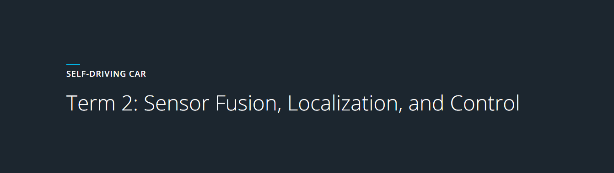

# [Udacity Self Driving Car Nanodegree](https://www.udacity.com/course/self-driving-car-engineer-nanodegree--nd013) 

This repository contains all the projects which have been completed by me for the Self Driving Car Nanodegree offered by [Udacity](https://medium.com/udacity/term-2-in-depth-on-udacitys-self-driving-car-curriculum-775130aae502#.l2pc1taps) of this program consists of three terms over nine months. This repository will be updated accordingly. 

## Term 2:  [Sensor Fusion, Localization, and Control](https://medium.com/@dsilver829/term-2-in-depth-on-udacitys-self-driving-car-curriculum-775130aae502#.sk03pvahx)

  #  | Title           |  Solution       | Techniques      | Libraries      | Dataset  
:---:|:--------------- | :-------------- | :-------------- | :--------------| :--------------
